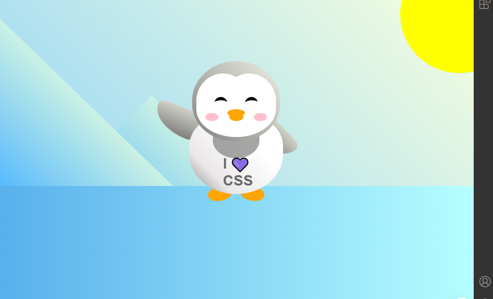

<h1 align="center"> Penguín </h1>

O principal desafio foi a construção de um desenho coerente e simpático apenas com CSS. Este projeto demandou compreensão aprofundada de formas geométricas com CSS e uso criativo de bordas arredondadas e posições relativas para posicionar cada detalhe do pinguim de maneira harmoniosa.

  <a href="#-tecnologias">Tecnologias</a>&nbsp;&nbsp;&nbsp;|&nbsp;&nbsp;&nbsp;
  <a href="#-projeto">Projeto</a>&nbsp;&nbsp;&nbsp;|&nbsp;&nbsp;&nbsp;
  <a href="#-layout">Layout</a>&nbsp;&nbsp;&nbsp;|&nbsp;&nbsp;&nbsp;
  <a href="#memo-licença">Licença</a>

  

 

  

## 🚀 Tecnologias

Esse projeto foi desenvolvido com as seguintes tecnologias:

- HTML para estrutura básica
- CSS (Flexbox e Grid para layout)

## 💻 Projeto

Projeto inspirado em cidades modernas e paisagens urbanas, este projeto foi desenvolvido para demonstrar o uso criativo do CSS na construção de visuais interativos e dinâmicos.

- [Acesse o projeto finalizado, online]

## :memo: Licença

Esse projeto está sob a licença MIT.

---

Feito com ♥ by Mauro do Sacramento.
